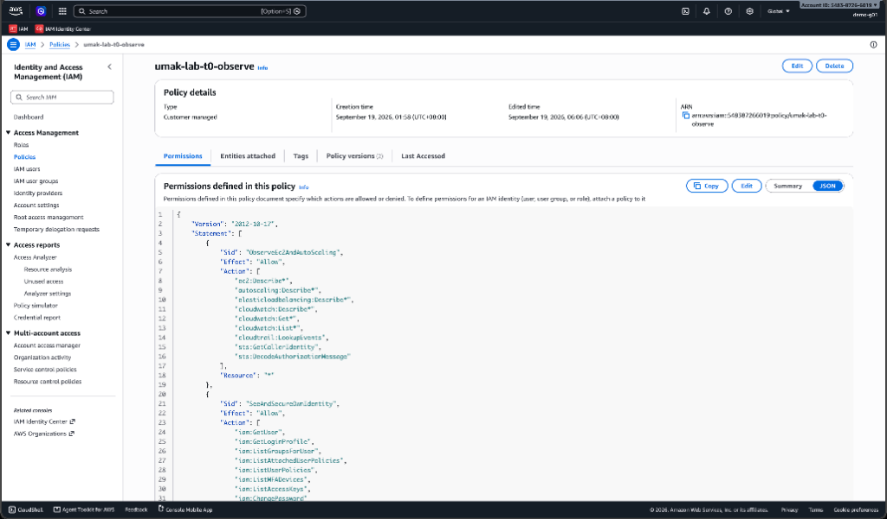
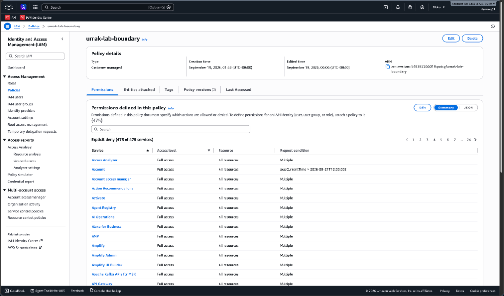
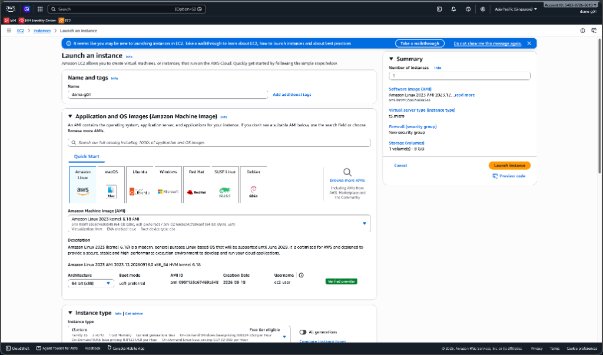
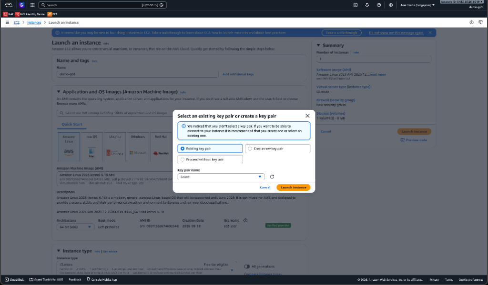
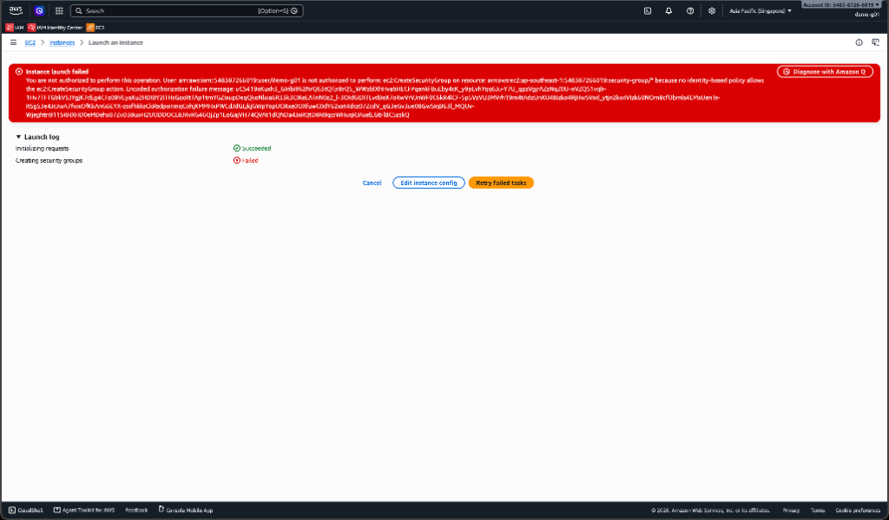

# Lab 1: Write and Attach an IAM Policy

> **Submission format:** This lab requires a Pull Request (PR) containing your `contribution.md` and `submission.md`. Once your PR is open, submit its link to the Google Form for peer evaluation: https://forms.gle/gNKDjFUTHgRwDTxm7. Do not merge your own PR.

## Team rules

- Teams have 3 or 4 people and sit in one pod. One IAM user belongs to the whole team. Every member can sign in on their own PC. Only the Driver clicks Create and Launch, so two people never change the same resource at once.
- Roles rotate at each lab part (Lab 1 Parts A to B, C, D to E, then Lab 2 steps 1 to 2, 3 to 4, 5 to 7): Driver (types), Navigator (reads the error aloud), Recorder (fills the worksheet), Reviewer (checks each step against the lab).
- The password emailed to you belongs to your team. Do not paste it into any chat, form, or repository. It stops working when the lab access window ends.
- Never create anything outside the Singapore Region (Asia Pacific, ap-southeast-1). The account blocks it.
- Every resource you create carries the tag `team` with your IAM user name as the value. Some steps fail without it. That is on purpose.

## What the account does automatically

| Control | Rule |
| --- | --- |
| Region lock | Only ap-southeast-1 works |
| Instance type lock | Only t3.micro can be launched |
| Disk size lock | Volumes over 8 GiB are denied |
| Maximum group size | Auto Scaling groups are capped at 2 instances |
| Automatic cutoff | 90 minutes after an instance launches, the account ends it or sets its group to 0 |
| Ownership by tag | You can change only resources tagged `team=<your user name>` |
| Time window | Launch and scaling actions are denied after the announced end time |
| Logging | Every call is recorded in CloudTrail |

**Goal:** Write an IAM policy, attach it to your team's IAM user, and use it to launch one t3.micro instance. Then attach a policy that is too wide, and see the permissions boundary stop it.

**Prerequisites:** Your team's IAM user name and password. A browser. The starter policy in this folder, [`lab1-policy-starter.json`](lab1-policy-starter.json).

**Duration:** 45 minutes. Answer the questions only after Part E.


In every step, replace `<user>` with your IAM user name, for example `acsad-g03`.

## Part A. Sign in and find your account ID (5 minutes)

1. Open the sign-in URL: `https://umak-elec3-cloud.signin.aws.amazon.com/console`. Enter your IAM user name and the password. Set a new password if the page asks.
2. In the top bar, open the Region menu and choose Asia Pacific (Singapore) `ap-southeast-1`.
3. In the top bar, click your user name. Copy the 12-digit Account ID from the menu.
4. Open the IAM service. In the left navigation pane, choose **Policies**. Click the **Filter** box, select **Customer managed**. Click on the policy named `umak-lab-t0-observe`. Open the JSON tab. Notice that no statement allows `ec2:RunInstances`.

    
5. Go back to the **Policies** list (still filtered to Customer managed). Click on `umak-lab-boundary`. Find the statement `DenyAnyInstanceTypeButT3Micro`.

    

## Part B. Try to launch, and read the denial (5 minutes)

1. Open EC2, then Instances, then Launch instances.
2. Name: `<user>-test`. Application and OS Image: Amazon Linux 2023. Instance type: `t3.micro`. Key pair: Proceed without a key pair. **Under Network settings, choose Select existing security group and pick the default one** (this prevents a security group error from hiding the instance error we want to study).

    

    
3. Click Launch instance. The console shows an error.

    
4. Copy the full error text into your `submission.md`. Underline or bold the action name after "not authorized to perform".

## Part C. Write your policy (12 minutes)

1. Open IAM, then Policies, then Create policy.
2. Choose the JSON editor. Delete the text in the editor. Paste the starter policy.
3. Replace every `<ACCOUNT_ID>` with your account ID from Part A. Use Find and replace if the editor offers it.
4. Fill the three blanks in the first statement, `RunOnlyT3MicroInstances`:
   - `"Action"`: the action from your Part B error.
   - `"Resource"`: the resource type from your error. It replaces `____` before `/*`.
   - `"ec2:InstanceType"`: the instance type you tried to launch.
5. Confirm the editor shows no red errors. Security warnings and suggestions are expected. A notice that you cannot validate the policy is also expected, because your user cannot call the policy validator. Click Next.
6. Policy name: `<user>-launch`. The name must start with your user name and a hyphen. Any other name is denied. Click Create policy.

## Part D. Attach the policy and launch (10 minutes)

1. Open the IAM service. In the left navigation pane, choose **Users**, then click your own user name (e.g., `acsad-g01`). Choose the Permissions tab, then Add permissions, then Attach policies directly.
2. In the search box, type `<user>-launch`. Tick the box next to your policy. Click Next, then Add permissions.
3. Wait 15 seconds. Refresh the page. The policy `<user>-launch` now appears under Permissions policies.
4. Open EC2, then Security Groups, then Create security group. Name: `<user>-web`. Description: `Lab 1`. VPC: the default VPC. Inbound rules: Add rule, Type HTTP, Source Anywhere-IPv4. Do not add a tag yet. Click Create security group. Copy the error text into your `submission.md`.
5. Repeat step 4. This time, under Tags, click Add new tag. Key: `team`. Value: `<user>`. Click Create security group. It succeeds.
6. Open EC2, then Instances, then Launch instances. Use the settings from Part B. Under Network settings, choose Select existing security group and pick `<user>-web`. Under Advanced or Resource tags, add tag Key `team`, Value `<user>`, Resource types Instances. Click Launch instance. Do not skip the tag. An instance without the `team` tag launches, but your user cannot terminate it, even with `ec2:*` attached. Only the 90-minute cutoff ends it.
7. Open the instance list. Wait until Instance state is Running. Write the time in your `submission.md`. The 90-minute cutoff clock starts now.

If step 6 fails, copy the error text. Read the action and the resource in it. Find the statement in your policy that allows it, and fix the policy. To edit: IAM, Policies, `<user>-launch`, Edit, JSON tab. Save changes, wait 15 seconds, and retry.

## Part E. Test the boundary (8 minutes)

1. Launch a second instance as in Part D, but choose instance type `t3.small`. Copy the error. It says explicit deny in a permissions boundary.
2. Open IAM, then Policies, then Create policy, then the JSON editor. Paste this policy:

   ```json
   {
     "Version": "2012-10-17",
     "Statement": [{ "Effect": "Allow", "Action": "ec2:*", "Resource": "*" }]
   }
   ```

   Name it `<user>-too-wide`. Create it. Attach it to your user as in Part D steps 1 to 3.
3. Wait 15 seconds. Try the `t3.small` launch again. It is still denied.
4. Switch the Region to Asia Pacific (Tokyo). Try to launch any instance. Because the permissions boundary denies actions outside Singapore, the console immediately displays red error markers for the AMI and VPC selectors; copy the text from these error markers into `submission.md`. Switch back to Singapore.
5. Open your user, then the Permissions tab. Select `<user>-too-wide`, click Remove, and confirm. Then open IAM, Policies, select `<user>-too-wide`, and choose Delete.
6. Open EC2, Instances. Select the instance from Part D. Choose Instance state, then Terminate (delete) instance. This works because the instance carries your `team` tag.
7. Open CloudTrail, then Event history. Set Lookup attributes to User name and enter `<user>`. Open one `RunInstances` event whose Error code is `Client.UnauthorizedOperation`. Events with `Client.DryRunOperation` are the console's own permission check, so skip them. Find the field `errorMessage`. New events can take several minutes to appear. If the list is empty, do Part F first and come back.

## Part F. Questions and evidence (5 minutes)

Answer in your `submission.md`.

1. Which action did the Part B error name?
2. In your policy, which condition limits `ec2:RunInstances`?
3. After you attached `ec2:*` on `*`, why was `t3.small` still denied? Name the boundary statement.
4. Why is `ec2:*` on `*` a poor policy even with a boundary?
5. In two sentences: what does the boundary control that your policy cannot?

### Required Screenshots
Embed these in your `submission.md` (and save the image files in your submission directory):
1. Screenshot of the Part B launch error with your user name visible.
2. Screenshot of your user's Permissions tab listing `<user>-launch`.
3. Screenshot of the instance in the Running state.
4. Screenshot of the `t3.small` or Tokyo denial (red error markers or denial dialog).
5. Screenshot of the CloudTrail event with `errorMessage`.

## Final PR Checklist

Your Pull Request must contain:
1. `contribution.md`: A markdown table showing who played which role (Driver, Navigator, Recorder, Reviewer) in each part of the lab. You can copy `contribution-template.md` to start.
2. `submission.md`: The file containing your error logs, embedded screenshots, the 3 filled blanks from Part C, and your answers to the 5 questions. You can copy `submission-template.md` to start.
3. Your screenshot image files stored in your submission directory alongside `submission.md`.

*Tip: Check out `submission-example.md` in this folder to see what a finished submission should look like.*

**Expected output:** One denied launch before your policy. One created and attached policy. One Running t3.micro. Two boundary denials that stay denied after `ec2:*` is attached. One CloudTrail event.
