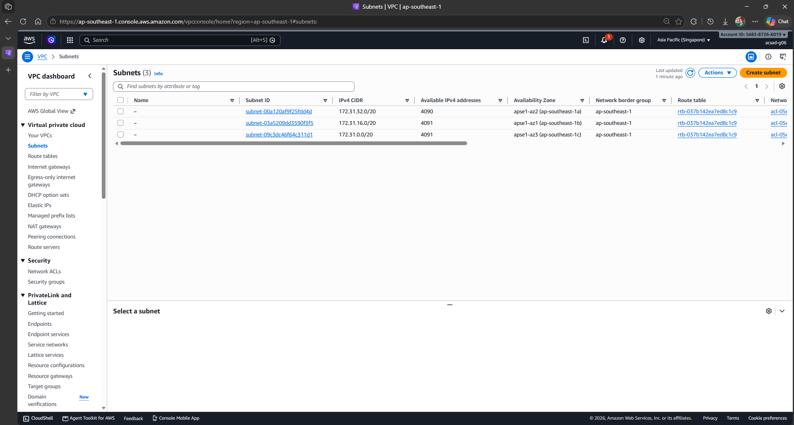
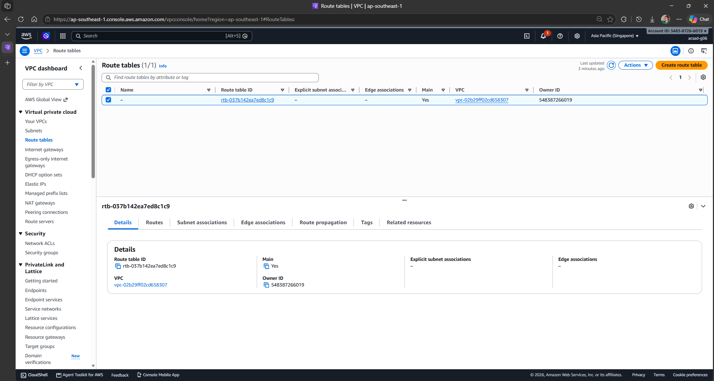
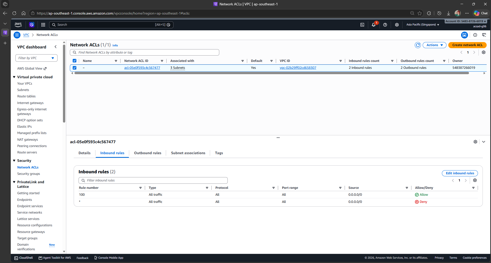
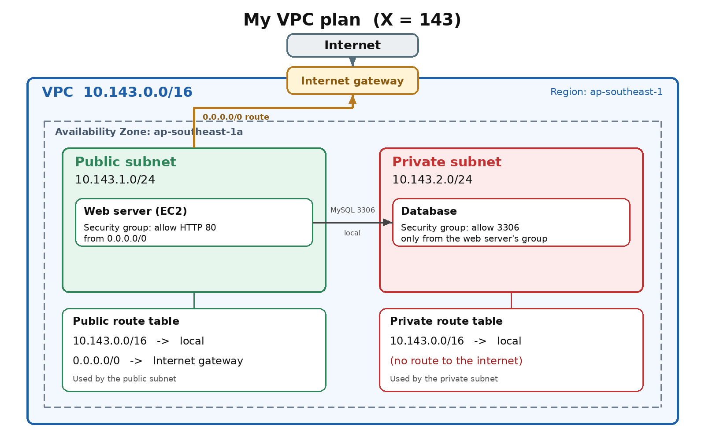

# Assignment 2 Submission

## About me

- GitHub username: tlswlgus
- Section: IV-ACSAD
- IAM user name that I signed in with: acsad-g06
- X: 143

---

## Part A. Explore

### A1. The VPC

Default VPC IPv4 CIDR:

172.31.0.0/16 (vpc-02b29ff02cd658307)

Number of addresses in that CIDR:

65,536. A /16 has 16 free bits, and 2^16 = 65,536.

### A2. The subnets

| Availability Zone | IPv4 CIDR |
| --- | --- |
| ap-southeast-1a | 172.31.32.0/20 |
| ap-southeast-1b | 172.31.16.0/20 |
| ap-southeast-1c | 172.31.0.0/20 |

### A3. Available addresses

Available IPv4 addresses in each subnet:

ap-southeast-1a: 4,090; ap-southeast-1b: 4,091; ap-southeast-1c: 4,091

Why is the number lower than 4,096?

A /20 has 4,096 addresses, but AWS reserves 5 in every subnet (the first four and the last one). So at most 4,091 addresses are usable.

What uses the missing address in the subnet with the lowest number?

The subnet with the lowest number (4,090) is 172.31.32.0/20 in ap-southeast-1a. One more address is in use there by a network interface, for example the network interface of an EC2 instance from Lab 2. A stopped instance still keeps its address.

### A4. The route table

| Destination | Target |
| --- | --- |
| 172.31.0.0/16 | local |
| 0.0.0.0/0 | igw-0943e7e6f88293168 |

### A5. Public or private

Are the default subnets public or private? Which route proves it?

Public. All three subnets use the main route table (rtb-037b142ea7ed8c1c9), and its route 0.0.0.0/0 -> igw-0943e7e6f88293168 sends internet traffic to the internet gateway.

### A6. The internet gateway

State of the internet gateway:

Attached (igw-0943e7e6f88293168, attached to vpc-02b29ff02cd658307)

What happens to the default subnets if the gateway is detached?

The 0.0.0.0/0 route no longer has a working target, so the subnets lose their path to the internet and are effectively private.

### A7. NAT gateways

Number of NAT gateways:

0

Can a server in a new private subnet download updates? Why?

No. A new private subnet has only the local route, with no route to an internet gateway or a NAT gateway, so it cannot start connections to the internet. It would need a NAT gateway in a public subnet and a route 0.0.0.0/0 -> NAT gateway.

### A8. The network ACL

| Rule number | Source | Allow or Deny |
| --- | --- | --- |
| 100 | 0.0.0.0/0 | Allow |
| * | 0.0.0.0/0 | Deny |

How is a network ACL different from a security group?

A network ACL is a firewall on a whole subnet. It has allow and deny rules, checked by rule number from lowest to highest, and it is stateless, so each direction needs its own rule. A security group is a firewall on a resource, such as an instance. It has allow rules only and is stateful, so replies go back out without a separate rule.

### A9. The default security group

Inbound rule (type and source):

All traffic, with the default security group itself as the source.

Which resources can send traffic to an instance that uses it?

Only resources that use the same default security group.

---

## Part B. Prepare

### B1. Plan two subnets

- Public subnet CIDR: 10.143.1.0/24
- Private subnet CIDR: 10.143.2.0/24

### B2. Route tables

Route table of the public subnet:

| Destination | Target |
| --- | --- |
| 10.143.0.0/16 | local |
| 0.0.0.0/0 | internet gateway |

Route table of the private subnet:

| Destination | Target |
| --- | --- |
| 10.143.0.0/16 | local |

### B3. My VPC diagram

Tool used (Excalidraw, draw.io, Lucidchart, or paper):

Diagram image generated with an AI assistant (Claude) from my own plan.

### B4. Predict a change

Can you still open the web page from your laptop? Why?

No. Without the route 0.0.0.0/0 -> internet gateway, traffic from the internet cannot reach the instance and replies cannot go back, so the subnet is no longer public.

Can the instance still reach another instance in the VPC? Why?

Yes. The local route (10.143.0.0/16 -> local) stays in every route table, so the subnets in the VPC can still reach each other.

### B5. Place a database

Which subnet gets the database? Why?

The private subnet (10.143.2.0/24). It has no route to the internet gateway, so nobody on the internet can reach it directly. Its security group should allow the database port (for example 3306) only from the web server's security group.

### B6. My question about VPCs

What is your question, and what made you think of it?

If a private subnet needs updates, how do I decide between a NAT gateway and a VPC endpoint, since a NAT gateway costs money every hour? I thought of it because the README says a NAT gateway is billed hourly and the class account has none.
